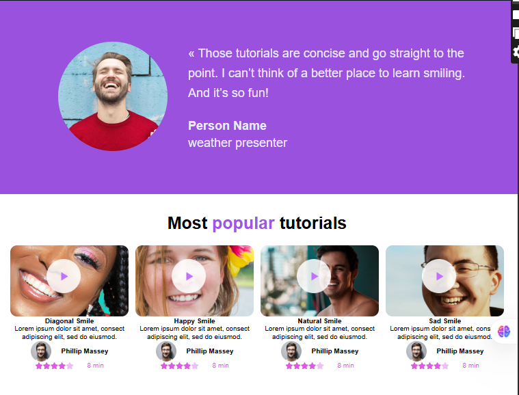
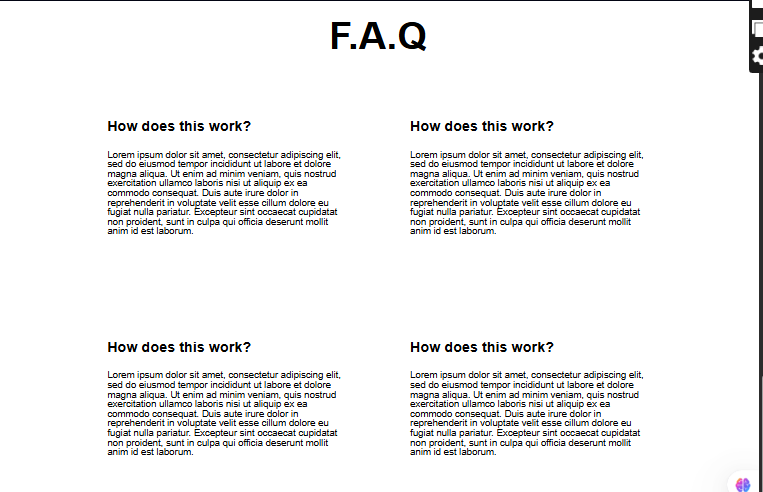
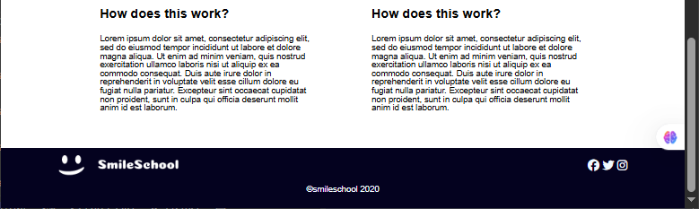

 

📸 Preview

Replace this with a screenshot of your page

📁 Folder Structure

📦 SmileSchool/
├── index.html          # Main HTML page
├── styles.css          # Custom styles
├── reset.css           # CSS Reset
├── /images             # All images (logo, avatars, icons)
└── README.md           # You're reading it :)

🚀 Features

🧠 Hero Section – Eye-catching heading with a clear call-to-action
       
 

⭐ Instructor Cards – Features pro smile teachers with awards

🎥 Video Tutorials – Most popular smile tutorials with ratings

🆓 Membership Benefits – What you get when you join

❓ FAQs – Common questions and answers

📱 Responsive Design – Looks great on mobile, tablet, and desktop

🎨 Font Awesome Icons – For ratings and social media links

🧩 Built With
HTML5 – Semantic layout and accessibility-friendly

CSS3 – Flexbox, Grid, and utility classes

Font Awesome – Star ratings, social icons

No frameworks – Pure HTML & CSS for learning and customization
